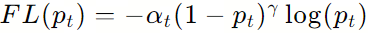

视频笔记

1、模型+代码解释器：

视频中的举例是一个曲线积分的求解，这个例子是一个很好的思路，对于现实中的行业来说，可以将专业软件的代码和大模型结合形成新的解决方案。

2、实用的数据分析功能：

首先上传一张表格.csv，然后让模型分析一下文件,模型会通过代码撰写把表格读入，然后可以要求模型按照表格数据绘制图表。（Python中的matplotlib）。模型可通过写代码去分析数据。还可以要求模型用一个机器学习的线性模型来做预测。这个是我比较关注和感兴趣的点，这个工具可以实现行业里的一些快速分析报告，提高生产效率。

3、多模态智能体工具箱AgentLego也是亮点。同样可以将行业里的专业软件和Agent结合做出垂直领域的工具箱。

4、这里有一个比较关心的问题：这些操作可以实现企业私有化吗？还是必须在线操作？

InternLM2技术报告笔记

将整个技术报告通读了一遍，感兴趣的有以下几点：

1.  预训练数据部分

    ​         文本部分的数据标准化为指定的格式（这个格式是Json格式吗？），按类型和语言对它们进行分类，并以JSON Lines（jsonl）格式存储它们。对于数据的清洗是基于规则的过滤、数据重复数据删除、安全过滤和质量过滤四种办法。启发式统计规则对数据进行过滤，得到干净的数据。接下来，使用局部敏感哈希（LSH）方法进行重复数据删除，以获得重复数据删除数据。然后，我们应用一种复合安全策略来过滤数据，从而得到安全数据。我们对不同来源的数据采用了不同的质量过滤策略，最终获得了高质量的训练前数据。之前没有做过这方面的工作，所以查阅了一下这些方法的概念。
    
​        启发式统计规则是一种使用简化的数学方法来估计数据的统计特性的技术。这些规则基于经验观察和预先确定的规则，而不是严格的数据分析和统计建模。启发式方法通常用于解决复杂问题，当精确的方法不可行或计算成本过高时。在统计学中，启发式方法可用于近似数据分布、估计参数或测试假设。虽然启发式方法可能不总是产生精确的结果，但它们可以提供快速和有用的近似，特别是在数据有限或计算资源有限的情况下。这里是一些启发式统计规则的例子：
    
​       1\.贝叶斯定理：它用于更新关于假设的信念，基于新证据。它表明，后验概率（更新后的信念）等于似然（新证据的概率，假设假设为真）和先验概率（更新前的信念）之比。
    
    ​       2\.奥卡姆剃刀：它建议，在解释数据时，我们应该首选最简单的解释，即假设最少的参数。这是一种避免过度拟合数据的简单方法。

    ​       3\.洛德法则：它指出，对于一系列独立事件（例如抛硬币），最可能的结果是最常见的结果。例如，如果我们抛一个公平的硬币10次，我们期望得到5个正面和5个反面，即使实际结果可能不同。
    
​      4\.达芬奇原则：它指出，自然倾向于最小化能量并采取最简单的路径。这可以应用于各种科学领域，从物理学到生物学。
    
    ​      5\.盖茨比偏差：它是一种认知偏见，指人们倾向于过度估计与他们自己的意见、信仰和行为相异的人的数量。这种偏见可以影响我们对世界事件的解释和我们对他人的看法。

    局部敏感哈希（LSH）
    
​       是一种用于近似最近邻搜索和相似性搜索的随机化技术。它通过将数据项映射到哈希表中的桶来工作。LSH的关键思想是设计哈希函数，以便相似的数据项有更高的概率被映射到相同的桶中。这使得LSH 可以用于快速找到给定查询项的最接近邻居。LSH方法通常用于大数据集和高维空间，其中其他最近邻搜索方法可能太慢或太不切实际。它已应用于各种应用程序，包括图像检索、文本分类和推荐系统。LSH的主要优点之一是它可以扩展到大型数据集，并可以在分布式环境中进行高效处理。然而，它的主要限制是它只能提供近似的最近邻，而不能保证找到确切的最近邻。
    
    局部敏感哈希（LSH）可在多个领域中应用，包括：

    ​      1\.图像检索：LSH可用于检索与给定查询图像类似的图像。图像可表示为特征向量，LSH用于找到最近的邻居。
    
    ​      2\.文本分类：LSH可用于将文档分类到预定义类别中。文档可表示为词袋模型或TF-IDF特征，LSH用于找到最近的邻居。
    
​      3\.推荐系统：LSH可用于根据用户以前的行为和兴趣推荐项目。用户和项目可表示为特征向量，LSH用于找到最近的邻居。
    
​      4\.生物信息学：LSH可用于比较基因序列或蛋白质结构的相似性。序列或结构可表示为特征向量，LSH用于找到最近的邻居。
    
    ​      5\.机器学习：LSH可用于加速机器学习算法的训练，例如k-近邻算法和支持向量机。LSH可用于近似最近的邻居或近似最近的点。

    这些只是LSH可以应用的几个领域的例子。LSH的主要优势在于它可以处理高维数据并扩展到大型数据集，使其适用于处理大量数据的领域。
    
删除重复文本
    
    ​       采用了一种基于局部敏感哈希（LSH）的MinHash方法对数据进行模糊重复数据删除。MinHash（最小哈希）是一种在数据挖掘和信息检索领域中用于估计两个集合相似度的技术。这种方法特别适合处理大规模数据集，因为它能够有效地减少计算资源的消耗，同时提供相对准确的相似度估计。MinHash的核心思想是将原始数据集中的元素映射到一个较小的、随机排列的全集中，然后通过比较这些随机排列后的集合来估计原始集合间的相似度。具体来说，MinHash通过以下步骤实现：

    ​       构建0-1矩阵：首先，将每个集合表示为一个0-1矩阵，其中每一行代表集合中的一个元素，每一列代表全集中的一个元素。如果集合中包含该元素，则相应的位置为1，否则为0。
    
​      随机排列：接着，对0-1矩阵进行随机行打乱。这意味着每一列的顺序都是随机的，但同一行内的顺序保持不变。
    
    ​      计算最小哈希值：对于每个集合，MinHash值是打乱后矩阵中第一个值为1的行的行号。这个值可以看作是集合的一个代表性指标。

    ​      相似度估计：通过比较两个集合的MinHash值，可以估计它们的Jaccard相似度。Jaccard相似度是指两个集合交集大小与并集大小的比例。MinHash的性质保证了两个集合的MinHash值相等的概率与它们的Jaccard相似度相等。

    MinHash技术在多个领域都有广泛的应用，例如：

    ​      文本聚类：将文本转换为词的集合，然后使用MinHash估计文本间的相似度，从而进行聚类分析。

    ​      推荐系统：在推荐系统中，MinHash可以用来估计用户的兴趣集合与其他用户或商品集合的相似度，从而推荐相关的商品或内容。

    ​      网页去重：在搜索引擎中，MinHash可以帮助识别重复或相似的网页，提高搜索结果的质量。

    

2. 训练了两个分类器，分别是"色情分类器"和"毒性分类器"。这部分技术报告中有说明，这里省略。

   

3. 在长上下文训练中，当适应这些较长的序列时，技术报告说将旋转位置嵌入（RoPE）基从50000调整到1000000，这个是实验的结果吗？

   

4. COOL Reinforcement Learning from Human Feedback

   ​        RLHF在实际应用中存在一些问题：偏好冲突（提供有用的信息而不产生有害的或不适当的内容），现有的RLHF方法通常依赖多种偏好模型进行评分，在训练流程中引入了更多的模型增加了计算成本，减慢了训练速度。其次，RLHF面临着奖励黑客的问题，即随着规模的增加，策略变得更加强大时模型可能会学习通过捷径"欺骗"奖励系统以获得高分，而不是真正学习预期的行为。

   ​       COOL RLHF引入了一种条件奖励机制来协调不同的偏好，它允许奖励模型根据特定的条件动态地将其注意力分配到不同的偏好上，从而最优地整合多种偏好。此外，COOL RLHF采用了多轮的Online RLHF策略，使LLM能够及时适应新的人类反馈，减少了奖励黑客攻击的发生。

​      条件奖励模型代表了一个创新的解决方案。传统方法通常依赖多个偏好模型来解决不同领域的偏好冲突（图8(a)），条件奖励模型包含了不同的系统提示，针对不同类型的偏好，从而有效地模拟单一奖励模型中的各种偏好。

图8：条件奖励模型的架构。(a) LLaMA2采用了不同的奖励模型来解决偏好冲突的问题。(b)所提出的条件奖励模型（我们的）利用条件系统提示来协调不同领域的偏好数据，允许使用单一奖励模型对多个偏好进行建模。

5、解决数据集中易样本和难样本之间的不平衡问题

借鉴了视觉里面处理样本不平衡常用的Focal Loss，将排名损失函数改为了Focal排名损失函数。

排名损失函数是用于评估和优化信息检索系统中文档排名的质量的一种方法。在Borges et al.(2005)的工作中，他们提出了一种基于排序的损失函数，用于学习到的文档排名模型的训练。这种损失函数的目标是最小化相关文档和不相关文档之间的排名差异。在Borges et al.(2005)提出的模型中，排名损失函数可以表示为：

其中：

w是模型的参数（例如，文档的权重或特征）。N是相关文档的数量。M是所有文档的总数。P(w,d)是给定参数w时，文档dj被模型预测为相关的概率。第一个求和项鼓励模型提高所有相关文档的排名（即，让它们的概率P(w,dj)接近1）。第二个求和项鼓励模型降低所有不相关文档的排名（即，让它们的概率P(w,dj)接近0）。

这种损失函数的直观理解是，对于每个相关文档，我们希望它在所有文档中的排名尽可能高，而对于每个不相关文档，我们希望它的排名尽可能低。通过这种方式，模型被训练来区分相关和不相关的文档，并提高相关文档的可见性。在实际应用中，这个损失函数可以通过梯度下降或其他优化算法来最小化，从而调整模型参数w，使得模型能够更好地对文档进行排序。这种方法在信息检索和推荐系统中得到了广泛的应用，因为它能够有效地处理大规模数据集，并且在处理长尾分布的文档排名问题时表现出色。

Focal Loss是一种在深度学习中用于分类问题的损失函数，特别是在目标检测任务中，如在Faster R-CNN中使用。它由Tsung-Yi Lin等人在2017年的论文《Focal Loss for Dense Object Detection》中提出。Focal Loss的主要目的是解决类别不平衡问题，特别是在背景类别（背景或负样本）远多于前景类别（目标或正样本）的情况下。Focal Loss的设计基于Cross Entropy Loss，它通过调整Cross Entropy Loss来减少对易分类样本的关注，使模型更加关注那些难以分类的样本。这种调整通过引入一个调制因子（modulation factor）来实现，该因子与每个样本的分类概率成函数关系。

Focal Loss的公式如下：

其中：

pt是模型对于第t个类别的预测概率。对于正样本，pt是模型预测为正类的概率；对于负样本，pt是模型预测为负类的概率。

at是平衡类别权重的系数，用于调整不同类别的损失贡献。在实践中，通常对所有类别使用相同的at或者根据类别频率进行加权。

γ是调节因子，用于减少对易分类样本的关注。γ的值通常设置在(0,1)之间，其中较小的γ值意味着对难分类样本更大的关注。

log(pt)是Cross Entropy Loss的标准部分，用于计算模型预测概率与实际标签之间的差异。

整个损失函数的目标是最小化所有样本的Focal Loss之和，这样可以使得模型在训练过程中更加关注那些难以正确分类的样本，从而提高模型对少数类别的识别能力。

Focal Loss的一个关键优点是它允许模型在面对大量背景样本时，不会过于关注那些容易分类的样本，而是将更多的学习焦点放在那些难以区分的样本上。这在目标检测等任务中尤其有用，因为这些任务通常包含大量的背景像素，而目标对象相对较少。通过使用Focal Loss，可以显著提高模型在这些任务中的性能。

我们这里需要的是排名损失函数的第一项，也就是要鼓励模型提高所有相关文档的排名，所以用第一项结合Focal loss函数，我们可以推导出Focal排名损失函数。在排序损失中增加了难度衰减系数，使困难样本的损失值大，容易样本的损失值小，防止了大量容易样本的过拟合。Focal排名损失被表示为

其中，Pi，j=σ（ri−rj）表示*rewardi*大于*rewardj* 的概率。难度衰减系数只有在模型正确预测训练样本的偏好时才生效，即Pi，j \>0.5，否则为1。γ项代表了一个超参数，它有助于调节困难衰减比，默认将它设置为2。同时，为了确保奖励模型在不同训练中的输出分数的稳定性和一致性，我们对奖励分数引入对数惩罚，将分数分布限制在-5到5的范围内，定义为

这种约束是至关重要的，因为它避免了在PPO阶段需要修改额外的与奖励相关的超参数（这里的这句话不太明白），这可能是由于不同奖励模型中的奖励分数分布的变化而产生的。总体而言，奖励模型的损失函数是

参数λ是平衡Lrinnk和Lphinte贡献的加权系数。根据我们在初步实验结果中的观察结果，我们将其设置为默认值0.02。这些增强提高了奖励模型的鲁棒性和一致性，特别是在以容易和困难样本之间的不平衡为特征的数据集背景下。
